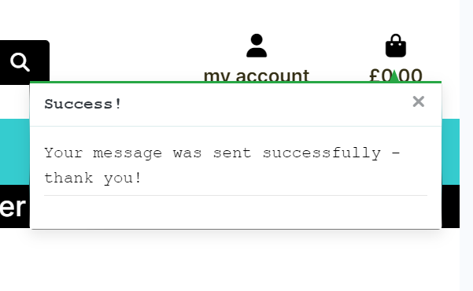

# Testing

Return back to the [README.md](README.md) file.

## Code Validation

### HTML

I have used the recommended [HTML W3C Validator](https://validator.w3.org) to validate all of my HTML files and used the [Validate by uri](https://validator.w3.org/#validate_by_uri) for the live pages.

| Page | W3C URL | Screenshot | Notes |
| --- | --- | --- | --- |
| Home | [W3C](https://validator.w3.org/nu/?doc=https%3A%2F%2Fnyreewaters-art-ccb67c4ebd7f.herokuapp.com%2F) |  | Pass: No Errors|
| About | [W3C](https://validator.w3.org/nu/?doc=https%3A%2F%2Fnyreewaters-art-ccb67c4ebd7f.herokuapp.com%2Fabout%2F) |  | Pass: No Errors |
| Products | [W3C](https://validator.w3.org/nu/?doc=https%3A%2F%2Fnyreewaters-art-ccb67c4ebd7f.herokuapp.com%2Fproducts%2F%3Fsort%3Dprice%26direction%3Dasc) |  | Warning (2): section lacks headings |
| Product Details | [W3C](https://validator.w3.org/nu/?doc=https%3A%2F%2Fnyreewaters-art-ccb67c4ebd7f.herokuapp.com%2Fproducts%2Fproduct_detail%2F15%2F) |  | Warning (1): section lacks headings |
| Add Product | [W3C](https://validator.w3.org/nu/?doc=https%3A%2F%2Fnyreewaters-art-ccb67c4ebd7f.herokuapp.com%2Fproducts%2Fadd%2F) |  | Pass: No Errors |
| Edit Product | [W3C](https://validator.w3.org/nu/?doc=https%3A%2F%2Fnyreewaters-art-ccb67c4ebd7f.herokuapp.com%2Fproducts%2Fedit%2F15%2F) |  | Pass: No Errors |
| FAQs | [W3C](https://validator.w3.org/nu/?doc=https%3A%2F%2Fnyreewaters-art-ccb67c4ebd7f.herokuapp.com%2Ffaqs%2F) |  | Pass: No Errors |
| Bespoke | [W3C](https://validator.w3.org/nu/?doc=https%3A%2F%2Fnyreewaters-art-ccb67c4ebd7f.herokuapp.com%2Fbespoke%2F) |  | Pass: No Errors |
| Bespoke Success | [W3C](https://validator.w3.org/nu/?doc=https%3A%2F%2Fnyreewaters-art-ccb67c4ebd7f.herokuapp.com%2Fbespoke%2Fbespoke_success%2F&showsource=yes) |  | Pass: No Errors |
| Contact | [W3C](https://validator.w3.org/nu/?doc=https%3A%2F%2Fnyreewaters-art-ccb67c4ebd7f.herokuapp.com%2Fcontact%2F) | [screenshot](documentation/html-validation-contact.png) | Pass: No Errors |
| Bag | [W3C](https://validator.w3.org/nu/?doc=https%3A%2F%2Fnyreewaters-art-ccb67c4ebd7f.herokuapp.com%2Fbag%2F) |  | Pass: No Errors |
| Checkout | [W3C](https://validator.w3.org/nu/?doc=https%3A%2F%2Fnyreewaters-art-ccb67c4ebd7f.herokuapp.com%2Fcheckout%2F) |  | Warning (2): section lacks headings |
| Checkout Success | [W3C](https://validator.w3.org/nu/?doc=https%3A%2F%2Fnyreewaters-art-ccb67c4ebd7f.herokuapp.com%2Fcheckout%2Fcheckout_success%2FAE806850B71840C693B8FF6921505B95) |  |  |
| Profile | [W3C](https://validator.w3.org/nu/?doc=https%3A%2F%2Fnyreewaters-art-ccb67c4ebd7f.herokuapp.com%2Fprofile%2F) |  | Pass: No Errors |


### CSS

I have used the recommended [CSS Jigsaw Validator](https://jigsaw.w3.org/css-validator) to validate all of my CSS files.

| File | Jigsaw URL | Screenshot | Notes |
| --- | --- | --- | --- |
| base.css | [Jigsaw](https://jigsaw.w3.org/css-validator/validator?uri=https%3A%2F%2Fnyreewaters-art-ccb67c4ebd7f.herokuapp.com%2F&profile=css3svg&usermedium=all&warning=1&vextwarning=&lang=en) |  | Pass: No Errors |
| checkout.css | n/a |  | Pass: No Errors |
| profile.css | n/a |  | Pass: No Errors |
| home-about.css | n/a |  | Pass: No Errors |
| faq.css | n/a |  | Pass: No Errors |
| contact.css | n/a |  | Pass: No Errors |

### JavaScript

I have used the recommended [JShint Validator](https://jshint.com) to validate all of my JS files.

| File | Screenshot | Notes |
| --- | --- | --- |
| stripe_elements.js |  | Undefined Stripe variable - external library |
| countryfield.js |  | Pass: No Errors |

### Python

I have used the recommended [PEP8 CI Python Linter](https://pep8ci.herokuapp.com) to validate all of my Python files.

| File | CI URL | Screenshot | Notes |
| --- | --- | --- | --- |
| Bag urls.py | [PEP8 CI](#) |  | Pass: No Errors |
| Bag views.py | [PEP8 CI](#) |  | Pass: No Errors |
| Bag apps.py | [PEP8 CI](#) |  | Pass: No Errors |
| Bag bagtools.py | [PEP8 CI](#) |  | Pass: No Errors |
| Bag contexts.py | [PEP8 CI](#) |  | Pass: No Errors |
| Checkout admin.py | [PEP8 CI](#) |  | Pass: No Errors |
| Checkout forms.py | [PEP8 CI](#) |  | Pass: No Errors |
| Checkout models.py | [PEP8 CI](#) |  | Pass: No Errors |
| Checkout signals.py | [PEP8 CI](#) |  | Pass: No Errors |
| Checkout urls.py | [PEP8 CI](#) |  | Pass: No Errors |
| Checkout views.py | [PEP8 CI](#) |  | Pass: No Errors |
| Checkout webhook_handler.py | [PEP8 CI](#) |  | Pass: No Errors |
| Checkout webhooks.py | [PEP8 CI](#) |  | Error: Line too long |
| FAQs admin.py | [PEP8 CI](#) |  | Pass: No Errors |
| FAQs models.py | [PEP8 CI](#) |  | Pass: No Errors |
| FAQs urls.py | [PEP8 CI](#) |  | Pass: No Errors |
| FAQs views.py | [PEP8 CI](#) |  | Pass: No Errors |
| FAQs load_faqs.py | [PEP8 CI](#) |  | Pass: No Errors |
| Home urls.py | [PEP8 CI](#) |  | Pass: No Errors |
| Home views.py | [PEP8 CI](#) |  | Pass: No Errors |
| nyreewaters_art settings.py | [PEP8 CI](#) |  | Pass: No Errors (#noqa added for long host URL and django names) |
| nyreewaters_art urls.py | [PEP8 CI](#) |  | Pass: No Errors |
| nyreewaters_art views.py | [PEP8 CI](#) |  | Pass: No Errors |
| Bespoke forms.py | [PEP8 CI](#) |  | Pass: No Errors |
| Bespoke models.py | [PEP8 CI](#) |  | Pass: No Errors |
| Bespoke urls.py | [PEP8 CI](#) |  | Pass: No Errors |
| Bespoke views.py | [PEP8 CI](#) |  | Pass: No Errors |
| Products admin.py | [PEP8 CI](#) |  | Pass: No Errors |
| Products forms.py | [PEP8 CI](#) |  | Pass: No Errors |
| Products models.py | [PEP8 CI](#) |  | Pass: No Errors |
| Products urls.py | [PEP8 CI](#) |  | Pass: No Errors |
| Products views.py | [PEP8 CI](#) |  | Pass: No Errors |
| Products widgets.py | [PEP8 CI](#) |  | Pass: No Errors |
| Profiles forms.py | [PEP8 CI](#) |  | Pass: No Errors |
| Profiles models.py | [PEP8 CI](#) |  | Pass: No Errors |
| Profiles urls.py | [PEP8 CI](#) |  | Pass: No Errors |
| Profiles views.py | [PEP8 CI](#) |  | Pass: No Errors |
| Contact froms.py | [PEP8 CI](#) |  | Pass: No Errors |
| Contact models.py | [PEP8 CI](#) |  | Pass: No Errors |
| Contact urls.py | [PEP8 CI](#) |  | Pass: No Errors |
| Contact views.py | [PEP8 CI](#) |  | Pass: No Errors |
| Root Level custom_storages.py | [PEP8 CI](#) |  | Pass: No Errors |
| Root Level manage.py | [PEP8 CI](#) |  | Pass: No Errors |


## Browser Compatibility

I've tested my deployed project on multiple browsers to check for compatibility issues.
The browsers tested include:
- [Chrome](https://www.google.com/chrome)
- [Firefox](https://www.mozilla.org/firefox/developer)
- [Edge](https://www.microsoft.com/edge)
- [Safari](https://support.apple.com/downloads/safari)
- [Brave](https://brave.com/download)
- [Opera](https://www.opera.com/download)

| Browser | Home | Products | FAQs | Bespoke | About | Contact | Notes |
| --- | --- | --- | --- | --- | --- | --- | --- |
| Chrome |  |  |  |  |  | | Works as expected |
| Firefox |  |  |  |  |  | | Works as expected |
| Edge |  |  |  |  |  | | Works as expected |
| Safari |  |  |  |  |  | | Works as expected |
| Brave |  |  |  |  |  |  | Works as expected |
| Opera |  |  |  |  |  | | Works as expected |


## Responsiveness

I've tested my deployed project on multiple devices to check for responsiveness issues.

| Device | Home | Products | FAQs | About | Bespoke | Contact | notes |
| --- | --- | --- | --- | --- | --- | --- | --- |
| Mobile (DevTools - Samsung Galaxy S20 Ultra) |  |  |  |  | |  | Works as expected, but slightly extra horizontal scrolling on Products pages |
| Tablet (iPad Pro) |  |  |  |  |  |  | Works as expected (same image examples as Safari tests) |
| Desktop (20") |  |  |  |  | |  |  Works as expected, but slightly extra horizontal scrolling on Products pages |
| XL Monitor (24") |  |  |  |  |  |  | Works as expected, but slightly extra horizontal scrolling on Products pages |
| 4K Monitor |  |  |  |  |  |  | Works well, but slightly extra horizontal scrolling on Products pages, and page height is too small for shorter pages (minimum container height media queries needed)*|
| iPhone XS |  |  |  |  |  |  | Works as expected |

**Note * Although django-allauth pages were not included in this table, it must be noted that the page sizing (for shorter pages) is a styling issue here too. However, since it doesn't impact on the usability of the site, it was not a priority to fix at this stage. Some efforts were made with min-container-height and bottom padding in CSS.

## Lighthouse Audit

I've tested my deployed project using the Lighthouse Audit tool to check for any major issues.

| Page | Mobile | Desktop | Notes |
| --- | --- | --- | --- |
| Home |  |  | Slow response time due to large images, potential saving by improving the imaging sizing / ratio of bio image |
| About |  |  | Slow response time due to large images |
| Products |  |  | Slow response time due to large images |
| FAQs |  |  | Slow response time due to large images |
| Bespoke |  |  | Slow response time due to large images |
| Contact |  |  | Slow response time due to large images |
| Bag |  |  | Slow response time due to large images, +/- buttons and some form elements do not have a discernible name / label for accessibility* |
| Checkout |  |  | Slow response time due to large images |
| Checkout Success |  |  | Slow response time due to large images |

**Note** * Where Accessibility was lower than expected, this was due to not having time to fix the discernible names / labels for some visual elements. On other pages this was done, and this would be a priority for future work.

## Manual Testing

Manual testing was chosen over Automated testing in this instance due to time constraints and current lack of experience in writing tests.

Automated testing uses code to run test cases, and is generally more effective in terms of speed and efficency with larger scale projects.

Some automated tests were trialed for the Products views.py as a learning tool, but this was heavily due to the help of chatGPT so will be deleted before the project submission. I also got support from chatGPT when writing initial tests to trigger my custom error pages. It was helpful to be able to trigger an error case so that I could preview my rendered error template whilst building the HTML. For production however, the error testing code has been removed, and instead follows django's handling of custom error pages [as seen here](https://www.geeksforgeeks.org/python-django-handling-custom-error-page/).

Manual testing involves a developer testing the functionality of the site by checking each feature behaves as expected.

Results from these manual tests are below:


| Page | Expectation | Test | Result | Note | Screenshot |
| --- | --- | --- | --- | --- | --- |
| Home |  |  |  |  |  |
|  | Register / Login page opens when user clicks on the link in the 'my account' dropdown menu | Tested by clicking on 'my account' | Both the Register and Login pages opened when the links were clicked | Test concluded and passed |  |
| | Search bar returns product results from keywords that are searched | Tested by searching various keywords and checking results | Products matching the search terms were displayed on the page as expected, no results showed a message explaining this | Test concluded and passed |  |
| Navigation - All Pages | | | | | |
| | Navigation links in the footer should take the user to the appropriate page when they are clicked on | Tested by clicking on all nav links and checking the pages that open | All links opened the correct pages | Test concluded and passed |  |
| | Navigation links in the navbar should take the user to the appropriate page when they are clicked on | Tested by clicking on all nav links and checking the pages that open | All links opened the correct pages | Test concluded and passed |  |
| | Clicking on the shopping bag icon should take the user to the shopping bag page | Tested by clicking on the bag icon | Bag opens when clicked | Test concluded and passed |  |
| Admin Panel | | | | | |
| | Django admin interface should allow the logged in super-user to manage order details (and have access to user info, products etc) | Tested by changing order details and deleting items / orders from the Orders dashboard | Feature worked as expected, super-user has access to all expected details | Test concluded and passed |  |
| | Django admin interface should allow the logged in super-user to manage FAQs | Tested by changing adding / editing / deleting FAQs from the FAQs dashboard | Feature worked as expected | Test concluded and passed |  |
| Contact | | | | | |
| | Allows the user to fill out a form to submit a message to the shop owner. Current functionality expects a validated form results in a 'success' message returned to the user | Tested by completing the form, passing the validation by adding a first + last name / email / subject line / message | Feature works as expected, success message is shown | Test concluded and passed |  |
| FAQs | | | | | |
| | Feature should display the answer to each question as a drop down accordion when the user clicks on it | Tested by clicking on each question | FAQ answers were displayed when the question was clicked | Test concluded and passed |  |
| Shopping Bag | | | | | |
| | Allows users to add items to the bag, adjust the quantity to update the bag (no less than 1, or no greater than 99 items), and remove items from the bag | Tested by adding items, changing the quantity via the -/+ buttons, updating the bag by clicking 'update' and removing items by clicking 'remove'| Feature worked as expected | Test concluded and passed |  |
| Bespoke | | | | | |
| | Feature is expected to show details of the bespoke product on offer, and allow users to fill in an enquiry form to express interest. A successful form submission should result in the user being redirected to a thank you page confirming their enquiry was sent | Tested by filling out the form, answering the questions by selecting an answer or typing an appropirate input for the form to be valid. Clicking submit, then checking the confirmation page loads | Feature worked as expected and the bespoke success confirmation page loaded once the form was submitted | Test concluded and passed |  |

Details of further testing are below:

| Page | User Action | Expected Result | Pass/Fail | Comments |
| --- | --- | --- | --- | --- |
| Contact | | | | |
| | Click on Contact link in navbar | Redirects to contact form | Pass | |
| | Enter first/last name, subject and message| Fields will accept freeform text | Pass | |
| | Enter valid email address | Field will only accept email address format | Pass | |
| Register | | | | |
| | Click on Register button | Redirects to Sign Up page | Pass | |
| | Enter valid email address | Field will only accept email address format | Pass | |
| | Enter valid password (twice) | Field will only accept password format | Pass | |
| | Click on Sign Up button | Asks user to confirm email page | Pass | Email sent to user, email template as expected   |
| | Confirm email | Redirects user to blank Sign In page | Pass | |
| Log In | | | | |
| | Click on the Login link | Redirects to Login page | Pass | |
| | Enter valid email address | Field will only accept email address format | Pass | |
| | Enter valid password | Field will only accept password format | Pass | |
| | Click Login button | Redirects user to home page, with success message | Pass | |
| Log Out | | | | |
| | Click Logout button | Redirects user to logout page | Pass | Confirms logout first |
| | Click Confirm Logout button | Redirects user to home page, with successful signout message | Pass | |
| Profile | | | | |
| | Click on Profile button | User will be redirected to the Profile page | Pass | |
| | Update default delivery details via the form and click on the Update Information button | Success message confirms details have been updated, and they will be prefilled in the form for future | Pass | |
| | If previous orders exist, click on a previous order link | User will be redirected to the saved Order Confirmation page (that matches the order number) | Pass | |
| | Brute forcing the URL of an order history URL e.g. tested using a known order (see [bugs](#unfixed-bugs)): **'.../profile/order_history/9A52801D36774F548B6A83976676E621'** when a user is not signed in or the user order does not match the signed in user | A Forbidden 403 error should be triggered | Pass | Although the custom 403 error page isn't being shown during testing, the correct Forbidden error message is shown: 'You do not have permission to access this order.'|
| | As a non signed-in user, access the /profile/ URL | User will be redirected to the Sign In page since they are not autheniticated | Pass | |
| Products | | | | |
| | Click on product image | User will be redirected to the Product Details page | Pass | |
| Product Details | | | | |
| | Click on + / - button to add/remove product from bag | Quantity in bag will increase/decrease | Pass | |
| | Click on add to bag button to add product to bag | Item will be added to bag | Pass | |
| | Click on keep shopping button to add product to bag | Item will be added to bag | Pass | |
| Product Management | | | | |
| | When signed in as an admin user, click the Product Management link | User redirected to 'add product' page of product management | Pass | |
| | Admin user tries to add a product without filling out all the * input fields  | Error messages remind the user to enter information in the valid formats | Pass | |
| | Admin user tries to add a product with a price more than 6 digits | Error alert - failed to add product, and a direction in the form to enter a number less than 6 digits | Pass | |
| | Admin user tries to add a product with valid form inputs and an image | User is redirected to the product detail of the newly added product, with a success message to confirm and image displayed (uploaded to AWS cloud database) | Pass | |
| | Admin user tries to add a product with valid form inputs with NO image | User is redirected to the product detail of the newly added product, with a success message to confirm and a default 'no-photo' gif is displayed | Pass | |
| | Admin user tries to add a product without a rating (not required for form validation) | User is redirected to the product detail of the newly added product, with a success message to confirm and the rating displays as 'no rating' | Pass | |
| | Admin clicks the blue 'edit' button (a pencil icon) next to a product's detail | User is redirected to the 'edit product' page for that item, where the form is prefilled with the product details | Pass | |
| | Admin changes the details of the product via the 'edit product' form and clicks 'update product' | Changes are saved to the product listing, and the user is redirected to the Product Detail page for that item. A success message confirms the updated product  | Pass | |
| | Admin changes the details of the product via the 'edit product' form and clicks to 'remove image' | Changes are saved to the product listing, and the user is redirected to the Product Detail page for that item. The previous image has been removed, and is replaced with the default 'no-photo' gif. A success message confirms the updated product.  | Pass | |
| | Admin clicks the red 'delete' button (a trash icon) next to a product's detail | User is redirected to the All Items page where the product has been deleted, and a success message confirms the product is deleted | Pass | A delete confirmation modal needs to be implemented for future to prevent deleting products by mistake |
| | Non admin signed in / non-signed in users try to access the product management pages via the URLs e.g. **../products/add/ | An error message displays in the top corner of the site: "Sorry only store owners can do that" | Pass | |
| Checkout | | | | |
| | User submits invalid delivery details / payment details in the checkout form | Error messages are shown which direct the user to correct the information | Pass | |
| | User submits correct Stripe test payment card details along with validated personal information | A loading overlay is displayed while the order is processed. The Stripe webhook confirms the order in Stripe. The user is redirected to the checkout success page which displays the order confirmation and summary (also success toast message confirming an email is sent). | Pass | Email is sent to the registered email address from the checkout form :  |

## User Story Testing

| User Story | Screenshot |
| --- | --- |
| As a new user, I would like to explore some details about the artist, Nyree Waters, to see if her style and products may interest me |  |
| As a new user, I would like to browse interesting, unique art products available to buy online. |  |
| As a new user, I would like to create an account with a profile, so that I can save my order details and have a more personalised experience whilst shopping. |  |
| As an returning user, I would like to log into my account and view my profile, so I can access my saved personal details and previous orders. |  |
| As a returning user, I would like to browse products easily based on the type of artwork I am looking for, and have the ability to search for specific products. |  |
| As a user, I would like to browse products easily based on the type of artwork I am looking for, and have the ability to search for specific products. |  |
| As a returning user, I would like to sort products by various criteria to make the (e.g. price, type, name) so that I can find what I'm looking for more easily. |  |
| As a returning user, I would like to add items to a shopping bag to keep track of the products I wish to purchase, with the ability to add / remove items where necessary. |  |
| As a returning user, I would like to follow a familiar process for making a secure purchase via a checkout page, and have regular feedback that my information has been submitted and processed successfully.|  |
| As a returning user, I would like to receive an email confirmation of my order once I have purchased something, and have access to these details via my account for future reference. |  |
| As a returning user, I would like my order details to be saved to my profile, and have the option of add or updating my address for quick access in future. |  |
| As a returning user, I would like to view some details about payment /shipping / delivery before making a purchase. |  |
| As an Admin user or Site owner, I would like to manage the product listings that are displayed on the site |  |
| As an Admin user or Site owner, I would like secure access to editing or adding new products - and to add appropriate details such as SKU, product name and description, price and an image. |  |
| As an Admin user or Site owner, I would like the option to remove products that are no longer in stock / I no longer wish to sell. |  |
| As an Admin user or Site owner, I would like to manage the FAQ section so that I can easily update and add answers to common questions as required. |  |
| As an Admin user or Site owner, I would like to manage user permissions and roles, and control the access to the admin panel, ensuring the site data remains secure. |  |

## Bugs

### Issues with profile prefilling delivery data after an order 
- There was an issue with the template literal preventing the 'save info' box from rendering on the checkout template. 
- This meant that the updated delivery information in the checkout form could not be saved to the profile.
- A bug was found where the authentication attribute used was ```{if user.authenticated %}``` rather than ``````
- After this fix, the save box was successfully rendered when the user was logged in (ie the user is authenticated)

### Issue with SMTP TypeError (causing System 505) for sending real emails
- This issue was found when setting up the registration / verification with real email settings
- In debug mode, the error was coming up as: **TypeError at /accounts/signup/ - SMTP starttls() got an unexpected keyword argument 'keyfile'**
- A fix was found by searching for help on the Code Institute Slack channel after another student has used the Bug Report workflow app.
- To resolve the issue it was recommended to type the following into the CLI and push the changes: ```touch runtime.txt && echo "python-3.9.1.6" > runtime.txt```
- This still gave me a TypeError in debug mode, so with Code Institute tutor support, we updated the python version and deployed again.
- A different syntax error displayed this time, which was easy to fix and then emails were sending successfully for registering an account.

### Issue with emails sending an order confirmation after successful checkout
- Registration emails were sending at this point, but no order confirmation emails were being sent (although the success message was showing).
- Emails were being sent to the terminal while in development mode, but the settings were in place to only send real emails when in 'production' mode.
- Since there was a Stripe webhook in place to oversee the order process, this was investigated with help from CI tutors.
- Although the webhook code was set up fine, when checking the STRIPE keys, it was found that the webhook endpoint was set up for development environment only. This was why the emails worked in dev mode, but not for deployment.
- I had to creat a new webhook endpoint via Stripe and update the secret keys in my Heroku configuration variables to fix this.

### Issue with authentication of profile order history
- It was noticed during manual testing, that if a known order_history URL is used, anyone was able to access the particular order confirmation (which contains personal information)
- I used a known order_history URL which had been submitted from the superuser account:
    - .../profile/order_history/9A52801D36774F548B6A83976676E621
    - temporary email used: kakafo9063@digdy.com
- When I checked the order_history view within the Profile app, there was no @login_required decorator in place, so I fixed this.
- This time, if a user was not signed in, they were redirected to the Sign In page. But if a user WAS signed in, they could still access the order_history even though it was not their order.
- To fix this, I added a check to verify the UserProfile of the signed in user matched that of the order before returning the order details.
- If the signed in user does not match the order user, then a Forbidden 403 response is triggered. I didn't get my custom 403 page to be triggered during testing, so this is potentially an unfixed bug, but the correct error message was displayed and the action prevented.
- If a user was not signed in at the time of making the order (which is possible), then their details would not be saved to a profile for an order_history page to be accessible (which is the benefit of an account). So I think this short term fix is enough  for now but for a real ecommerce site, there would need to be much stronger security in place.

## Unfixed Bugs

### Custom error 403 page not rendering when a HttpResponseForbidden is triggered
- As explained above, I could not get my custom 403.html to be rendered when testing the authentication error that triggers a Forbidden response. I kmow the 404.html page works and this is set up in the same way, but I did not have time to look into this further. Using automated test cases would help troubleshoot the issue.

### Extra horizontal styling on Products pages noticed during Responsiveness testing
- Please see [responsiveness](#responsiveness) testing for details

### Page height too small for shorter pages with less content
- Please see [responsiveness](#responsiveness) testing for details
- Fixes were attempted using the min-height-container class but possibly more media queries are needed to work on different devices sizes. Does not affect usability too much.

### Some errors in console displayed for the favicon
- Occasionally this would happen and noticed in Google Chrome's DevTools, but the favicon still worked and was displayed so I think this is not something to worry about / may be an external issue.

### Some form elements without discernible name / label for improved accessibility
- Please see [responsiveness](#responsiveness) testing for details
- Fixes were attempted across the site, but some elements were missed - particularly on the shopping bag page.

### HTML validation warning regarding lack of header h2-h6
- Known warning and acceptable, section doesn't require headers

### Lack of prefilling email address for signed in users (e.g. on Contact and Bespoke forms)
- This was overlooked and not enough time to address, but will implement for future work.
