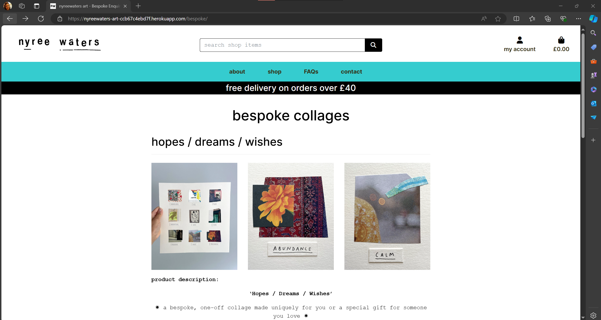
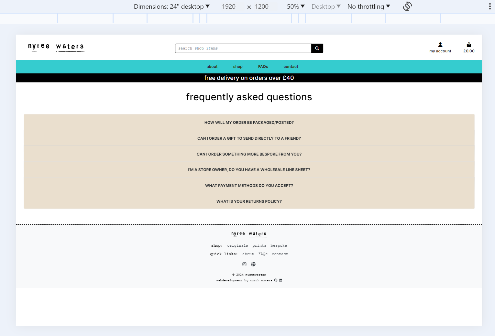

# Testing

Return back to the [README.md](README.md) file.

## Code Validation

### HTML

I have used the recommended [HTML W3C Validator](https://validator.w3.org) to validate all of my HTML files and used the [Validate by uri](https://validator.w3.org/#validate_by_uri) for the live pages.

| Page | W3C URL | Screenshot | Notes |
| --- | --- | --- | --- |
| Home | [W3C](https://validator.w3.org/nu/?doc=https%3A%2F%2Fnyreewaters-art-ccb67c4ebd7f.herokuapp.com%2F) |  | Pass: No Errors|
| About | [W3C](https://validator.w3.org/nu/?doc=https%3A%2F%2Fnyreewaters-art-ccb67c4ebd7f.herokuapp.com%2Fabout%2F) |  | Pass: No Errors |
| Products | [W3C](https://validator.w3.org/nu/?doc=https%3A%2F%2Fnyreewaters-art-ccb67c4ebd7f.herokuapp.com%2Fproducts%2F%3Fsort%3Dprice%26direction%3Dasc) |  | Warning (2): section lacks headings |
| Product Details | [W3C](https://validator.w3.org/nu/?doc=https%3A%2F%2Fnyreewaters-art-ccb67c4ebd7f.herokuapp.com%2Fproducts%2Fproduct_detail%2F15%2F) |  | Warning (1): section lacks headings |
| Add Product | [W3C](https://validator.w3.org/nu/?doc=https%3A%2F%2Fnyreewaters-art-ccb67c4ebd7f.herokuapp.com%2Fproducts%2Fadd%2F) |  | Pass: No Errors |
| Edit Product | [W3C](https://validator.w3.org/nu/?doc=https%3A%2F%2Fnyreewaters-art-ccb67c4ebd7f.herokuapp.com%2Fproducts%2Fedit%2F15%2F) |  | Pass: No Errors |
| FAQs | [W3C](https://validator.w3.org/nu/?doc=https%3A%2F%2Fnyreewaters-art-ccb67c4ebd7f.herokuapp.com%2Ffaqs%2F) |  | Pass: No Errors |
| Bespoke | [W3C](https://validator.w3.org/nu/?doc=https%3A%2F%2Fnyreewaters-art-ccb67c4ebd7f.herokuapp.com%2Fbespoke%2F) |  | Pass: No Errors |
| Contact | [W3C](https://validator.w3.org/nu/?doc=https%3A%2F%2Fnyreewaters-art-ccb67c4ebd7f.herokuapp.com%2Fcontact%2F) |  | Pass: No Errors |
| Bag | [W3C](https://validator.w3.org/nu/?doc=https%3A%2F%2Fnyreewaters-art-ccb67c4ebd7f.herokuapp.com%2Fbag%2F) |  | Pass: No Errors |
| Checkout | [W3C](https://validator.w3.org/nu/?doc=https%3A%2F%2Fnyreewaters-art-ccb67c4ebd7f.herokuapp.com%2Fcheckout%2F) |  | Warning (2): section lacks headings |
| Checkout Success | [W3C](https://validator.w3.org/nu/?doc=https%3A%2F%2Fnyreewaters-art-ccb67c4ebd7f.herokuapp.com%2Fcheckout%2Fcheckout_success%2FAE806850B71840C693B8FF6921505B95) |  |  |
| Profile | [W3C](https://validator.w3.org/nu/?doc=https%3A%2F%2Fnyreewaters-art-ccb67c4ebd7f.herokuapp.com%2Fprofile%2F) |  | Pass: No Errors |

### CSS

I have used the recommended [CSS Jigsaw Validator](https://jigsaw.w3.org/css-validator) to validate all of my CSS files.

| File | Jigsaw URL | Screenshot | Notes |
| --- | --- | --- | --- |
| base.css | [Jigsaw](https://jigsaw.w3.org/css-validator/validator?uri=https%3A%2F%2Fnyreewaters-art-ccb67c4ebd7f.herokuapp.com%2F&profile=css3svg&usermedium=all&warning=1&vextwarning=&lang=en) |  | Pass: No Errors |
| checkout.css | n/a |  | Pass: No Errors |
| profile.css | n/a |  | Pass: No Errors |
| home-about.css | n/a |  | Pass: No Errors |
| faq.css | n/a |  | Pass: No Errors |
| contact.css | n/a |  | Pass: No Errors |

### JavaScript

I have used the recommended [JShint Validator](https://jshint.com) to validate all of my JS files.

| File | Screenshot | Notes |
| --- | --- | --- |
| stripe_elements.js |  | Undefined Stripe variable - external library |
| countryfield.js |  | Pass: No Errors |

### Python

I have used the recommended [PEP8 CI Python Linter](https://pep8ci.herokuapp.com) to validate all of my Python files.

| File | CI URL | Screenshot | Notes |
| --- | --- | --- | --- |
| Bag urls.py | [PEP8 CI](#) |  | Pass: No Errors |
| Bag views.py | [PEP8 CI](#) |  | Pass: No Errors |
| Bag apps.py | [PEP8 CI](#) |  | Pass: No Errors |
| Bag bagtools.py | [PEP8 CI](#) |  | Pass: No Errors |
| Bag contexts.py | [PEP8 CI](#) |  | Pass: No Errors |
| Checkout admin.py | [PEP8 CI](#) |  | Pass: No Errors |
| Checkout forms.py | [PEP8 CI](#) |  | Pass: No Errors |
| Checkout models.py | [PEP8 CI](#) |  | Pass: No Errors |
| Checkout signals.py | [PEP8 CI](#) |  | Pass: No Errors |
| Checkout urls.py | [PEP8 CI](#) |  | Pass: No Errors |
| Checkout views.py | [PEP8 CI](#) |  | Pass: No Errors |
| Checkout webhook_handler.py | [PEP8 CI](#) |  | Pass: No Errors |
| Checkout webhooks.py | [PEP8 CI](#) |  | Error: Line too long |
| FAQs admin.py | [PEP8 CI](#) |  | Pass: No Errors |
| FAQs models.py | [PEP8 CI](#) |  | Pass: No Errors |
| FAQs urls.py | [PEP8 CI](#) |  | Pass: No Errors |
| FAQs views.py | [PEP8 CI](#) |  | Pass: No Errors |
| Home urls.py | [PEP8 CI](#) |  | Pass: No Errors |
| Home views.py | [PEP8 CI](#) |  | Pass: No Errors |
| nyreewaters_art settings.py | [PEP8 CI](#) |  | Pass: No Errors (#noqa added for long host URL and django names) |
| nyreewaters_art urls.py | [PEP8 CI](#) |  | Pass: No Errors |
| nyreewaters_art views.py | [PEP8 CI](#) |  | Pass: No Errors |
| Bespoke forms.py | [PEP8 CI](#) |  | Pass: No Errors |
| Bespoke models.py | [PEP8 CI](#) |  | Pass: No Errors |
| Bespoke urls.py | [PEP8 CI](#) |  | Pass: No Errors |
| Bespoke views.py | [PEP8 CI](#) |  | Pass: No Errors |
| Products admin.py | [PEP8 CI](#) |  | Pass: No Errors |
| Products forms.py | [PEP8 CI](#) |  | Pass: No Errors |
| Products models.py | [PEP8 CI](#) |  | Pass: No Errors |
| Products urls.py | [PEP8 CI](#) |  | Pass: No Errors |
| Products views.py | [PEP8 CI](#) |  | Pass: No Errors |
| Products widgets.py | [PEP8 CI](#) |  | Pass: No Errors |
| Profiles forms.py | [PEP8 CI](#) |  | Pass: No Errors |
| Profiles models.py | [PEP8 CI](#) |  | Pass: No Errors |
| Profiles urls.py | [PEP8 CI](#) |  | Pass: No Errors |
| Profiles views.py | [PEP8 CI](#) |  | Pass: No Errors |
| Contact froms.py | [PEP8 CI](#) |  | Pass: No Errors |
| Contact models.py | [PEP8 CI](#) |  | Pass: No Errors |
| Contact urls.py | [PEP8 CI](#) |  | Pass: No Errors |
| Contact views.py | [PEP8 CI](#) |  | Pass: No Errors |
| Root Level custom_storages.py | [PEP8 CI](#) |  | Pass: No Errors |
| Root Level manage.py | [PEP8 CI](#) |  | Pass: No Errors |

## Browser Compatibility

I've tested my deployed project on multiple browsers to check for compatibility issues.
The browsers tested include:
- [Chrome](https://www.google.com/chrome)
- [Firefox (Developer Edition)](https://www.mozilla.org/firefox/developer)
- [Edge](https://www.microsoft.com/edge)
- [Safari](https://support.apple.com/downloads/safari)
- [Brave](https://brave.com/download)
- [Opera](https://www.opera.com/download)

| Browser | Home | Products | FAQs | Newsletter | Which Scent? | Notes |
| --- | --- | --- | --- | --- | --- | --- |
| Chrome |  |  |  |  |  |Works as expected |
| Firefox |  |  |  |  |  |Works as expected |
| Edge |  |  |  |  |  |Works as expected |
| Safari |  |  |  |  |  |Minor CSS differences |
| Brave |  |  |  |  |  |Works as expected |
| Opera |  |  |  |  |  |Minor differences |

## Responsiveness

I've tested my deployed project on multiple devices to check for responsiveness issues.

| Device | Home | Products | FAQs | Newsletter | Which Scent | Notes |
| --- | --- | --- | --- | --- | --- | --- |
| Mobile (DevTools - Samsung Galaxy S20 Ultra) |  |  |  |  | | Works as expected |
| Tablet (iPad Air) |  |  |  |  |  | Works as expected |
| Desktop |  |  |  |  | |  Works as expected |
| XL Monitor |  |  |  |  |  | Scaling starts to have minor issues |
| 4K Monitor |  |  |  |  |  | Noticeable scaling issues |
| iPhone XS |  |  |  |  |  | Works as expected |

## Lighthouse Audit

I've tested my deployed project using the Lighthouse Audit tool to check for any major issues.

| Page | Mobile | Desktop | Notes |
| --- | --- | --- | --- |
| Home |  |  | Slow response time due to large images |
| About |  |  | Slow response time due to large images |
| Products |  |  | Slow response time due to large images |
| FAQs |  |  | Slow response time due to large images |
| Bespoke |  |  | Slow response time due to large images |
| Contact |  |  | Slow response time due to large images |
| Bag |  |  | Slow response time due to large images |
| Checkout |  |  | Slow response time due to large images |
| Checkout Success |  |  | Slow response time due to large images |